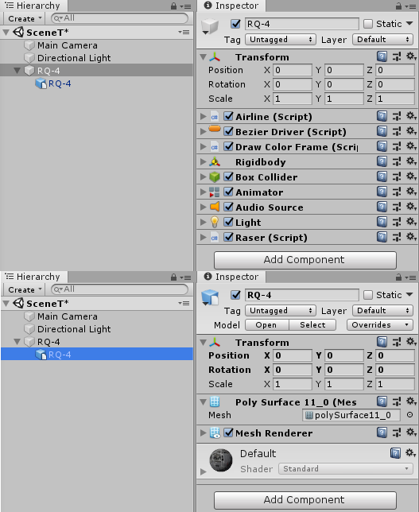

# SEUID项目规范

## 概述

本规范针对Unity项目涉及的所有文件。所有规则均严格按照<概述>-<要求>-<禁止>-<示例>的顺序编写。**要求项**使用:star:标识，**禁止项**使用:x:标识。​示例使用引用表示如下:

> 示例块
## TOC
   * [SEUID项目规范](#seuid项目规范)
      * [概述](#概述)
      * [1. 命名规范](#1-命名规范)
         * [1.1 通用命名](#11-通用命名)
         * [1.2 C#代码相关命名](#12-c代码相关命名)
            * [1.2.1 命名空间](#121-命名空间)
            * [1.2.2 类、结构体、接口、形参及成员](#122-类结构体接口形参及成员)
            * [1.2.3 .cs文件](#123-cs文件)
         * [1.3 Unity项目相关命名](#13-unity项目相关命名)
            * [1.3.1 项目文件夹](#131-项目文件夹)
            * [1.3.2 非源码资源](#132-非源码资源)
      * [2. 代码规范](#2-代码规范)
         * [2.1 布局规范](#21-布局规范)
            * [2.1.1 缩进及换行](#211-缩进及换行)
            * [2.1.2 代码空行](#212-代码空行)
            * [2.1.3 空格及括号规范](#213-空格及括号规范)
            * [2.1.4 类中布局规范](#214-类中布局规范)
         * [2.2 注释规范](#22-注释规范)
      * [3. Unity项目规范](#3-unity项目规范)
         * [3.1 目录结构规范](#31-目录结构规范)
            * [3.1.1 Assets](#311-assets)
            * [3.1.2 Scripts](#312-scripts)
         * [3.2 Scene Hierarchy及物体层级规范](#32-scene-hierarchy及物体层级规范)
         * [3.3 工作流规范](#33-工作流规范)
            * [4.1.1 模型](#411-模型)
            * [4.1.2 贴图](#412-贴图)


## 1. 命名规范

### 1.1 通用命名

所有命名基于以下两种命名规范：

+ PascalCasing
+ camelCasing

PascalCasing 约定每个单词的第一个字符大写（包括超过两个字母的首字母缩写），如以下示例所示：

>```c#
>PropertyDescriptor
>HtmlTag
>```

这里有一种特殊情况，即遇到两个字母的首字母缩略词时，两个字母都要大写，如<kbd>IOStream</kbd>

camelCasing约定将除第一个单词之外的每个单词的第一个字符大写，如以下示例所示。 该示例还显示，以 camelCasing 标识符开始的双字母缩写词都是小写的。

>```c#
>propertyDescriptor
>ioStream
>htmlTag
>```

:star:**要求**：

+ 所有命名必须有意义。
+ 除电子文档外，所有项目文件夹、代码文件、资源文件、代码标识符使用英文单词、英文缩写及数字组合命名。
+ 所有项目文件夹、代码文件命名基于PascalCasing规范。
+ 所有非源码资源文件命名基于camelCasing规范。
+ 命名中若需要分割多个单词组或数字，**仅**使用下划线<kbd>_</kbd>。
+ **电子文档可使用中文命名**，命名格式为<kbd>文件名_YYMMDD_VERSION</kbd>，其中<kbd>YYMMDD</kbd>为6位数日期，<kbd>VERSION</kbd>为两位数版本号，高位补零对齐（用于区分同一文件在同一天内多次修改的副本）。

:x:**禁止**：

+ 所有项目文件夹、电子文档、代码文件、资源文件、代码标识符的命名**禁止**使用<kbd>aaaa.cs</kbd>，<kbd>111.pptx</kbd>等无意义的元素命名。
+ 所有项目文件夹、电子文档、代码文件、资源文件、代码标识符的命名**禁止**出现空格<kbd> </kbd>。
+ 除电子文档外，所有项目文件夹、代码文件、资源文件、代码标识符**禁止**使用中文字符或拼音命名。
+ 除电子文档外，所有代码文件和资源文件**禁止**使用数字后缀区分文件。

对通用命名有以下正确示例：

> ```shell
> xxx项目开题报告_190421.docx		  (无同一天内的多个副本则不使用数字后缀)
> xxx使用说明_190514_03.md			  (该文件在同一天内的第三份修改存档)
> /Assets/02_Motions/Animations             (项目文件夹命名)
> KeyboardManager.cs		          (cs代码文件)
> ui_dateBar_background.png		  (资源文件)
> tree_small_trunk.fbx			  (资源文件)
> ```


### 1.2 C#代码相关命名

#### 1.2.1 命名空间

以下为命名空间命名的一般规则：

```c#
SEUID.(ProjectName)[.<Feature>][.<Subnamespace>]
```

其中<kbd>SEUID</kbd>为固定名称，<kbd>(ProjectName)</kbd>为当前项目名称，方括号<kbd>[]</kbd>内为可选项。

:star:要求：

+ 所有项目代码**必须**有明确的自定义命名空间。
+ 命名空间遵从PascalCasing。

:x:禁止：

- 不使用下划线、连字符或任何其他非字母数字的字符。
- 命名空间下的类名不可和该命名空间重名。

命名空间命名有以下正确示例：

> ```c#
> SEUID.JTZKGesture		        (命名空间至少含有项目名)
> SEUID.JTZKGesture.HMM.Core		(后续命名可选)
> ```


#### 1.2.2 类、结构体、接口、形参及成员

:star:要求：

+ 类、结构体、接口及成员命名遵从PascalCasing规范。
+ 形参命名遵从camelCasing规范。
+ 类、结构体的命名请使用**名词性**单词。
+ 接口命名请务必以大写字母<kbd>I</kbd>作为前缀，并使用**描述性名词**或**形容词**。
+ 成员方法命名请使用**动词性短语**或**动宾短语**。
+ 属性名称必须**名词短语**或**形容词**。
+ 事件名称使用**动词短语**命名。
+ 属性、字段若为布尔值，请考虑使用<kbd>Is</kbd>、<kbd>Can</kbd>或<kbd>Has</kbd>等表示是否的前缀。
+ 属性所封装的私有字段请考虑使用下划线<kbd>_</kbd>做前缀，后跟属性名。
+ 事件命名请考虑使用<kbd>On</kbd>前缀或<kbd>Has-Done</kbd>的形式。

:x:禁止：

+ 为类名，结构体名添加前缀。
+ 字段名称不可为**动词性**短语。

命名有以下正确示例：

> ```shell
> Person								(类名)
> RadarData							(结构体名)
> ILinkable							(接口名)
> public void CountCentrePoint(int startPoint, int endPoint)	(方法名，形参名)
> private int _Age						(字段名)
> public int Age							(属性名)
> protected bool IsActive					        (bool字段名)
> public bool CanTouch					        (bool字段名)
> public UnityEvent HasEnterProtectedZone	                        (事件名)
> public UnityEvent OnTouchNode			                (事件名)
> ```


#### 1.2.3 .cs文件

:star:要求：

+ 遵从PascalCasing规范
+ 文件名与脚本中主要类名一致。

:x:禁止：

+ **不可**使用数字前缀或后缀区分源码文件。

.cs文件命名有以下正确示例：

> KeyboardManager.cs
> PositionClipNode.cs


### 1.3 Unity项目相关命名

#### 1.3.1 项目文件夹

:star:要求：

+ 一个文件夹下应**只包含一种文件**，按照文件类型分类。

项目文件夹命名有以下正确示例：

> ```shell
> +Textures			        (Textures文件夹下全为纹理文件夹或文件)
> |----Trees
> |----Rockets
> |----background_island_AO.png
>
> Models					(Models文件夹下全为模型文件夹或文件)
> |----J20
> |----Carrier
> |----player.fbx
> ```


#### 1.3.2 非源码资源

:star:要求：

+ 为形成大小类型的包含关系，使用下划线<kbd>_</kbd>做分割。
+ 文件名中单词顺序应从大类向小类排列。
+ 同一大类资源的不同文件命名应使用**形容词性**或**状态、动作描述性**的后缀。
+ 仅在形容词性后缀不足以区分时，添加两位数字作为后缀，并在高位补零对齐。

:x:禁止：

+ **禁止**使用前缀区分同一大类下的不同文件，前缀区分会导致文件排序混乱。

非源码资源命名有以下正确示例：

>```shell
> +Models
> |----tree_small_trunk.fbx
> |----tree_small_leaves.fbx
> |----tree_small_roots.fbx		        (从大到小做分类命名)
>
> vehicle_truck_damaged.anim
> vehicle_truck_normal.anim			(使用形容词性的后缀区分)
> vehicle_truck_run_01.anim
> vehicle_truck_run_02.anim			(添加两位数字后缀区分)
> ```


## 2. 代码规范

### 2.1 布局规范

#### 2.1.1 缩进及换行

:star:要求：

+ 统一使用tab缩进，并在IDE中设置缩进为4个空格。
+ 所有花括号<kbd>{}</kbd>均**独占一行**。
+ 单行代码长度限制在100个字符，超长则换行，换行符不可在字符串中。参数过长则换行后逗号置行首，判断式过长则逻辑判断符置行首，以参数对齐或表达式对齐为目标。除此外换行缩进4个空格，第二次换行不缩进，与第一次缩进对齐。

:x:禁止：

+ **禁止**使用四个空格代替tab缩进。
+ **禁止**在字符串中换行。

有以下正确的缩进及换行示例：

> ```c#
> void function(int a
> 			, char b
> 			, short c
> 			, object k
> 			, string y)
> {
>  //参数换行示意
> }
> if( (expression01)
> && (expression02)
> && (expression03)
> || (expression04) )
> {
>  //表达式换行示意
> }
> ```


#### 2.1.2 代码空行

为使代码结构清晰，不同类型及层级的代码块间必须用空行隔离。

:star:要求：

+ 接口和类定义之间**空两行**。
+ 枚举和类定义之间**空两行**。
+ 类和类定义之间**空两行**。
+ 方法和方法，属性和方法， 字段和方法，字段和属性之间**空一行**。
+ 方法中变量声明和操作语句之间**空一行**。
+ 方法中不同逻辑块之间**空一行**。
+ <kbd>return</kbd>语句与其他语句之间**空一行**。
+ **注释与被注释语句间不空行**，但与其余所有语句间**空一行**。

:x:禁止：

+ 不可使用任意形式的注释行代替空行分割代码。
+ 代码不可使用空行开头。
+ 代码结尾不允许存在一行以上的空行。

使用代码空行布局有以下正确示例：

> ```c#
> interface IComputable
> {
>  //...
> }
> //接口和类定义之间空两行
> //<第二行>
> public class Person
> {
>  private int _Age;
>  private string _Name;
>  //字段和属性之间
>  public int Age
>  {
>      get
>      {
>          return _Age;
>      }
>  }
>  public string Name
>  {
>      //...
>  }
>  //属性和方法之间
>  public void FirstMethod()
>  {
>  }
>  //方法和方法之间
>  public int SecondMethod()
>  {
>      //...逻辑代码
>      //return语句与其他语句之间空一行
>      return para;
>  }
> }
> ```


#### 2.1.3 空格及括号规范

:star:要求：

+ 除了<kbd>.</kbd>以外，所有二元操作符左右需要使用空格分开。
+ 多个参数使用逗号分割，逗号后跟一个空格。

:x:禁止：

+ if、while、do、for等逻辑块内即使只有单行语句或为空，也不可省略花括号<kbd>{}</kbd>。

> ```c#
> int k = a + b;			//二元操作符前后均需要使用一个空格
> public string ClipStr(string str, int starIndex, int endIndex)	//形参逗号后跟一个空格
> if(index > 0)
> {					//单行语句也不可省略花括号
>     str = null;
> }
> ```


#### 2.1.4 类中布局规范

:star:要求：

+ 类的定义中按照<kbd>字段->属性->事件->方法</kbd>的顺序进行布局。
+ 各类成员内部按照<kbd>private->protected->public</kbd>的访问权限顺序排序。

:x:禁止：

+ **禁止**方法在字段前申明。

类中布局有以下正确示例：

> ```c#
> public class Person
> {
>     private int _Age;
>     protected string Name;
>     public double height;
>     
>     public int Age
>     {
>         get
>         {
>             return _Age;
>         }
>     }
>     
>     public UnityEvent OnNameChange;
>     
>     private void Jump()
>     {
>         //...
>     }
>     
>     protected int Count()
>     {
>         //...
>     }
>     
>     public void SayHello()
>     {
>         //...
>     }
> }
> ```


### 2.2 注释规范

为方便团队合作，代码维护，所有源码文件均需要一定量的注释辅助说明。

:star:要求：

+ 类定义之前使用XML注释描述该类的作用。
+ 重要的**标志类属性**后跟单行注释说明各个状态含义。
+ 方法定义之前使用XML注释描述该方法的作用、用法和形参列表，必要时指出参数含义。
+ 方法中的重要逻辑使用注释详细说明。

:x:禁止：

+ 使用注释分割代码块，或使用注释排版代码。

有以下正确的注释示例：

> ```c#
> ///<summary>
> ///描述该类的作用
> ///</summary>
> public class Person
> {
>     private int ChoosenState;	//用于表示被选中状态，1为xxx，2为xxx，3为xxx
>     
>     /// <summary>
>     /// 按页面分类获取轮播列表;
>     /// 当xxx情况时xxx，出现yyy情况时yyy
>     /// </summary>
>     /// <param name="call">接口响应</param>
>     /// <param name="parentId">父id</param>
>     /// <returns>DtoBanner，xxx情况下返回null</returns>
>     public static DtoBanner ListByType(AppCall call, int parentId)
>     {
>     	// 描述逻辑
>         // ...
>     	return null;
>     }
> }
> ```
>
> 

## 3. Unity项目规范

### 3.1 目录结构规范

#### 3.1.1 Assets

所有项目前两级目录使用统一标准，三级及以下目录不做要求，可自行命名，但务必遵从命名规范。

:star:要求：

+ 新建项目后首先按照示例建立标准目录结构。

:x:禁止：

+ 不要在shader文件上右键创建material，这样材质文件会自动生成在shader文件夹下。
+ 不允许将资源直接放在Assets文件夹下。

目录结构严格按照以下示例建立：

> ```shell
> Assets
> +---_Scenes	        # 使用下划线开头，保证场景文件夹在第一位
> +---01_Prefabs
> +---02_Motions
> |   +---Animations
> |   +---Animators
> |   +---Timeline	# 存放timeline相关的playable等文件
> +---03_Models
> +---04_Materials
> +---05_Textures		# 材质、光照贴图
> +---06_Effects
> |   +---Videos
> |   +---Sounds
> |   +---VFX	        # 存放后处理等视觉效果文件
> +---07_UI		# 存放界面相关图素
> |   +---Sprites
> |   +---Fonts
> |   +---Mask
> +---08_Src
> |   +---Scripts
> |   +---Shaders		# 包括Shader文件和Shadergraph
> ​```
> ```


#### 3.1.2 Scripts

脚本文件夹下的三级目录结构不作要求，**但应有第三级目录**，按照脚本作用对象或功能做分类，并推荐**将脚本命名空间与脚本目录结构**联系起来。

Scripts文件夹下示例结构如下：

> ```shell
> Scripts
> +---Enviroment
> +---Tools
> +---UI
> ```
> ```


### 3.2 Scene Hierarchy及物体层级规范

:star:要求：

+ Hierarchy中必须使用形如"-----Xxxx-----"的空物体做分割。
+ 所有对坐标和朝向无要求的GameObject都**必须**将Transform组件设置为原始状态，如挂载体感脚本的物体。
+ 所有需要添加Components的模型，**必须**新建一个空GameObject父物体作为相关组件挂载点，即所有模型上套一层空GameObject作为逻辑层。
+ 场景中尽量使用预制体作为运动或逻辑单元，例如，只在开发前期访问Models文件夹，后期只访问Prefabs文件夹。

:x:禁止：

+ 不允许将组件直接挂载在mesh组件所在的GameObject上。

Scene Hierarchy及物体层级设计有以下正确示例：

> ```shell
> -----Lights-----		# 必须使用空物体构建Hierarchy中的结构
> #此处放置场景中不随物体移动的静态光照，探针等#
> -----Managers-----
> InputManager			# 挂载键盘，鼠标，手柄，手势，体感等管理脚本
> SceneManager			# 挂载管理场景的脚本，如切换场景
> LogicManager			# 挂载各种不依赖挂载点的逻辑处理脚本
> -----ExternalUI-----
> #此处放置与第二显示器上UI相关的GameObject#
> -----Environments-----
> #此处放置环境模型，全局后处理等物体#
> -----Xxxxx------
> \``````
> ```
> 


### 3.3 工作流规范

####  4.1.1 模型

:star:要求：

+ 导入Unity项目的模型统一使用<kbd>FBX</kbd>格式。
+ 若模型在Unity中需要转动，移动，请务必在导出模型前在建模软件中**直接将模型中心设置在转轴交点处**或**方便操控移动的质心处**。
+ 模型使用左手坐标系，尺寸单位选择公制单位米，各轴缩放均归一化到1。

:x:禁止：

+ **不允许**为了实现转动，在Unity中使用脚本给出旋转轴的偏移量，旋转中心应在模型导出前设置标准。

模型标准参数有以下示例：

> +Y up, +Z forward, +X right （左手坐标系）
>
> Metric Unit System （选择公制单位米）
>
> Scale: 1:1:1 （三轴缩放值必是1）

#### 4.1.2 贴图

:star:要求：

+ 贴图文件格式统一为<kbd>PNG</kbd>、<kbd>TIFF</kbd>、<kbd>HDR</kbd>。
+ 贴图文件为正方形，且边长为2的整数次幂，依次为128x128、256x256、512x512、1024x1024 ```。
+ 材质贴图文件使用统一后缀区分。

材质贴图后缀如下表：

| Suffix |     Textures      |
| :----: | :---------------: |
|  _AL   |      Albedo       |
|  _SP   |     Specular      |
|   _R   |     Roughness     |
|  _MT   |     Metallic      |
|  _GL   |    Glossiness     |
|   _N   |      Normal       |
|   _H   |      Height       |
|  _DP   |   Displacement    |
|  _EM   |     Emission      |
|  _AO   | Ambient Occlusion |
|   _M   |       Mask        |
